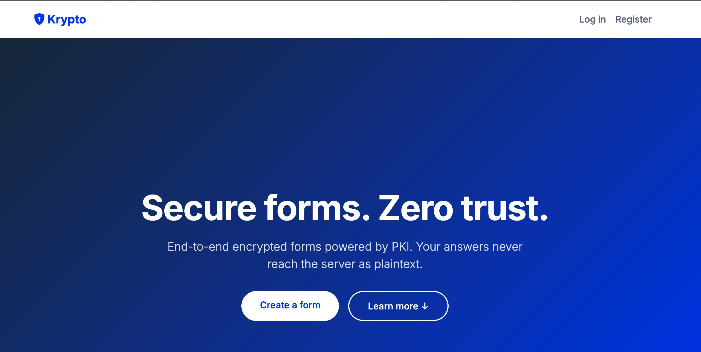
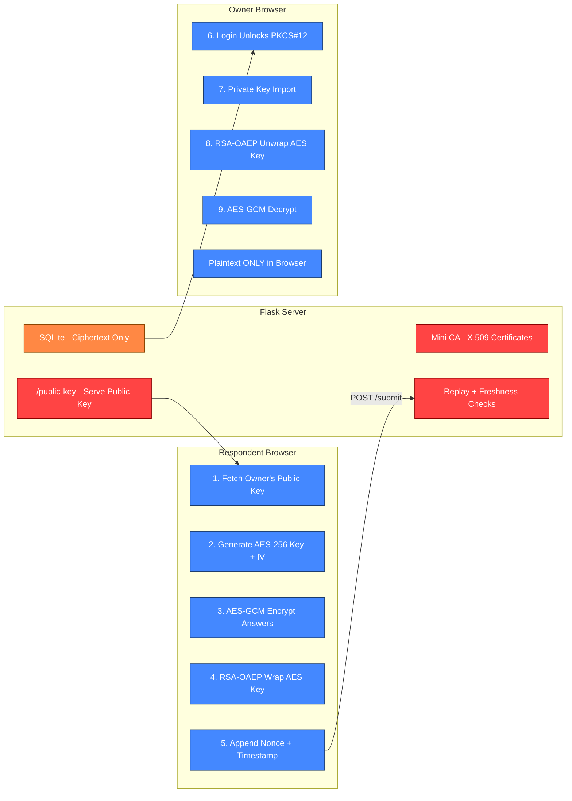

#  Encrypted Form Builder (krypto)
[](https://python.org)
[](LICENSE)
[](tests/)

#### *Krypto starts exactly where Google Forms stops being secure*

Krypto is an End-to-end encrypted form builder with PKI-based hybrid cryptography. Form responses are encrypted in the browser before they ever reach the server. 

## Why This Exists
Most form builders (Google Forms, Typeform, Jotform) store your data in plaintext in their server. The platform can read everything be it **medical histories, employee feedback, whistleblower reports.** If their database gets compromised, it's all your data that's going to be exposed.
Also there is a slight chance that the filled information (data) can be changed when data is in motion *(never say never)* and neither the form participant nor the form owner will know about that.

Krypto solves this by ensuring **only the form owner can decrypt all responses & If the data is modified in transit, the form owner will encounter a cryptographic failure when attempting to decrypt the response, indicating that the data may have been tampered with**

<p align="center">
  
</p>

## Architecture


## Setup

**1. Clone the repository**
```bash
git clone https://github.com/CryptoCrusaderX/encrypted-form-builder.git
cd encrypted-form-builder
```

**2. Create and activate a virtual environment**
```bash
python -m venv venv
source venv/bin/activate  # On macOS/Linux
venv\Scripts\activate     # On Windows
```

**3. Install dependencies**
```bash
pip install -r requirements.txt
```

**4. Initialize the database**
```bash
flask shell
>>> from models import init_db
>>> init_db()
>>> exit()
```

**5. Run the application**
```bash
flask run
```

Open `http://127.0.0.1:5000` in your browser.

> **Note:** The first user to register becomes the form owner. Subsequent users can fill forms but cannot create them.

## Features

- **End-to-end encryption**
  - AES-256-GCM encrypts data in the browser before submission.
  - RSA-2048-OAEP wraps the AES key using the owner's public key.
  - Server stores ciphertext only — plaintext never touches the server.

- **PKI infrastructure**
  - Mini Certificate Authority issues X.509 certificates for every user.
  - Private keys stored inside password-encrypted PKCS#12 keystores.

- **Form lifecycle & access control**
  - Retire forms to stop submissions. Delete individual responses.
  - Users must register to fill forms. Owners cannot submit to their own.

- **Replay & tamper protection**
  - UUID4 nonces + 5-minute freshness window prevent replay attacks.
  - AES-GCM authentication tags detect ciphertext modification.

## Testing

Run the test suite to verify functionality and attack simulations:

```bash
pytest tests/
```


## License

[MIT](LICENSE)
